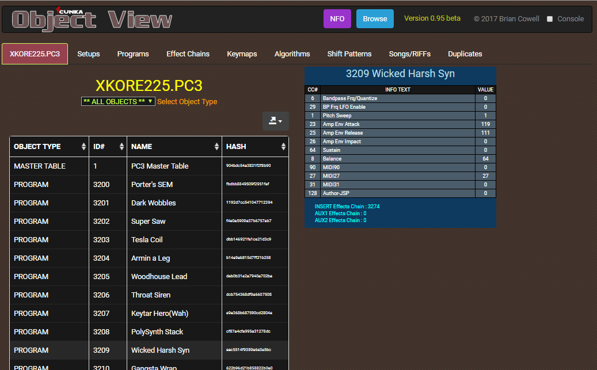
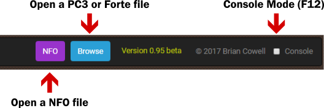
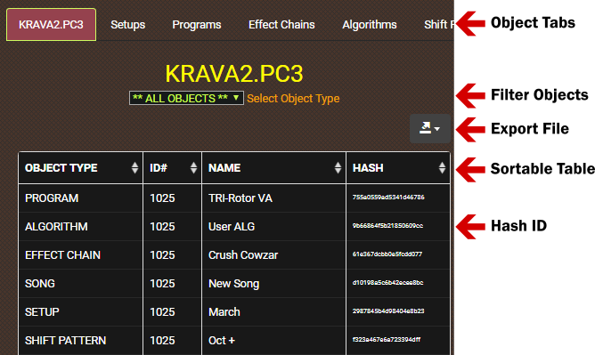
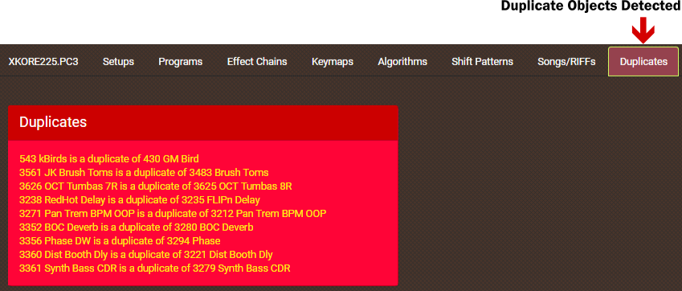
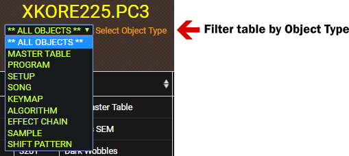
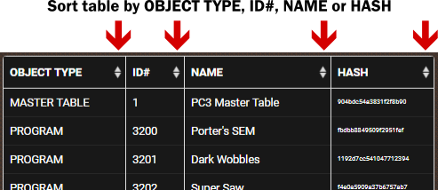
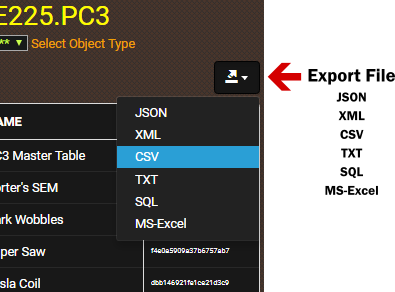
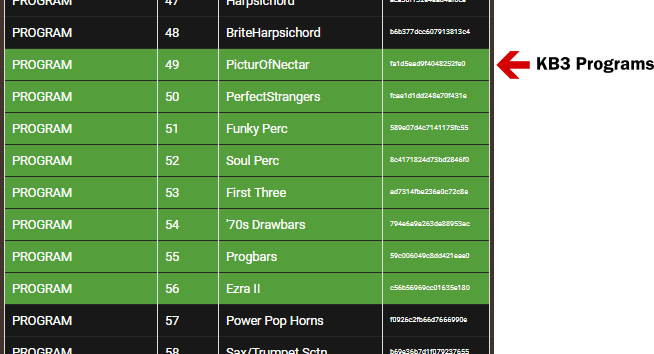
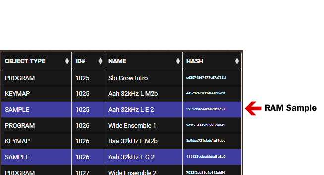
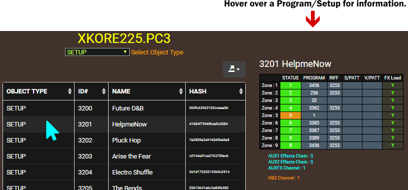

Open and view the objects from the Kurzweil PC3/Forte series files. 
* File types : .PC3 .P3K .P3A .FOR .NFO (PC3 only)
* Export : Excel, XML, JSON, CSV & SQL file formats

_NOTE : No PC3LE support (yet)_

---

## Getting Started
These instructions will get you a copy of __ObjectView__ up and running on your desktop computer. 
### Prerequisites
You will need a good modern desktop browser like Chrome, FireFox or Safari.
1. Download the ZIP to your computer. 
2. Unzip the contents and open the index.html file in your desktop browser.

### Open a PC3/Forte file

The top navigation bar has two buttons for loading files, called "NFO" & "Browse". To open and view a PC3 or Forte file, select the "Browse button". 

1. Click the Browse button.
2. Find the file _(must have either a .PC3 .P3K .P3A .FOR file extension)_
3. Click Open.

#### What is a NFO file?
_NFO files are exported currently only from the PC3 series._

To open and view a NFO file with __ObjectView__, select the "NFO" button.

NFO files can export all the controller information for Programs and Effects Chains from "Storage Mode". A NFO file is best thought of as Kurzweils fancy name for a CSV file, which you would commonly use in software like Microsoft EXCEL. It is simply a text file with a pipe delimiter. You can in fact load the NFO file with a program like EXCEL. I have provided it in __ObjectView__ for quick and easy viewing.

---

## Whats On Display

---

## Built With

* [JQuery](https://jquery.com/) - navigation
* [Bootstrap 3](https://getbootstrap.com/docs/3.3/) - front end framework
* [Awesome Functions](https://awesomefunctions.com/) - table generation and file exports
* [Papa Parse](http://papaparse.com/) - parsing NFO files

## Authors

* **Brian Cowell** - *Initial work* - [CUNKA](http://cunka.com/)

## Acknowledgments

* Kurzweil R&D 
* Kurzweil Tech Support
* [Mastering VAST Forum subscribers](http://forums.godlike.com.au/)
