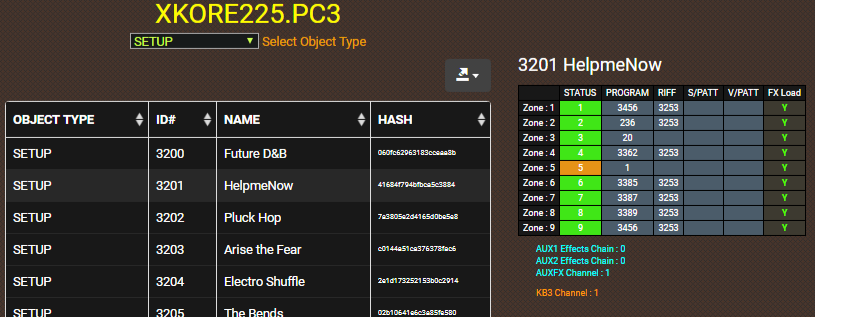

Open and view the objects from the Kurzweil PC3/Forte series files. 
* File types : .PC3 .P3K .P3A .PLE .FOR .NFO _(PC3 only)_
* Export : Excel, XML, JSON, CSV & SQL file formats

_NOTE : Limited PC3LE support _

---

## Getting Started
These instructions will get you a copy of __ObjectView__ up and running on your desktop computer. 
### Prerequisites
You will need a good modern desktop browser like Chrome, FireFox or Safari.
1. Download the ZIP to your computer. 
2. Unzip the contents and open the index.html file in your desktop browser.

### Open a PC3/Forte file

The top navigation bar has two buttons for loading files, called "NFO" & "Browse". To open and view a PC3 or Forte file, select the "Browse button". 

1. Click the Browse button.
2. Find the file _(must have either a .PC3 .P3K .P3A .PLE .FOR file extension)_
3. Click Open.

#### What is a NFO file?

Kurzweil use NFO files to export all the controller information for Programs and Effects Chains from "Storage Mode". 
_NFO files are exported currently only from the PC3 series._

A NFO file is best thought of as Kurzweils fancy name for a CSV file, which you would commonly use in software like Microsoft EXCEL. It is simply a text file with a pipe delimiter. You can in fact load the NFO file with a program like EXCEL. I have provided it in __ObjectView__ for quick and easy viewing

To open and view a NFO file with __ObjectView__, select the "NFO" button and then open either an INFO.NFO or INFOFX.NFO file. You must never rename these files as __ObjectView__ is expecting one of those named files.

---

## Whats On Display

When __ObjectView__ scans a file, it looks at the objects within that file and then searches to find if those objects are dependents of other objects. For example, a Program may be found, which uses an algorithm, keymap or effect chain. Those objects are dependents for the Program. So if you only loaded that Program and not the algorithm, keymap, effect chain, it would not sound the same or not sound at all.

The tabs across the top are the heart of __ObjectView__. At the very minimum, there is always at least one tab which is the file name. It contains the main table that shows all the objects found found in the file and the order it was saved in. The table lists the object type, object ID, object name and object hash. The contents of this table can be exported in variety of formats and used to document the file.

#### Object Tabs

Any object tabs shown on the top line are object types found within the file that have dependents. 

_NOTE : Forte currently shows a limited amount of object tabs._

#### Filter Objects

The table in __ObjectView__ can be filtered by object types. The selection "ALL OBJECTS" is selected by default.

#### Export File

The table can be exported into a variety of text formats. Export types are JSON, XML, CSV, TXT, SQL and MS EXCEL.
Exported is the object type, object ID, object name and object hash.

#### Sortable Table

The table can be sortable in variety of ways.You can sort by object type, object ID, object name or object hash.

#### Hash ID

The object hash is a unique feature on __ObjectView__ that takes an object and creates a mathematical number based on the contents of the object minus the objects name and ID. So with this number its possible to compare, find objects that are the same. 

An example is an effect chain may be called "1025 Brian1" and another effect chain called "1034 Brian2", if the numbers are the same, then objects are exactly the same except they have been renamed. This is very handy to find duplicate objects.

_(This technique is commonly used to download ZIP files and make sure that no-one has tampered with the contents)._ 

### Dependents

### Duplicates

### KB3 Programs

### RAM samples

### Program INFO

### Setup infomation

---

## Built With the following Javascript libraries

* [JQuery](https://jquery.com/) - navigation
* [Bootstrap 3](https://getbootstrap.com/docs/3.3/) - front end framework
* [Awesome Functions](https://awesomefunctions.com/) - table generation and file exports
* [Papa Parse](http://papaparse.com/) - parsing NFO files

## Authors

* **Brian Cowell** - [CUNKA](http://cunka.com/)

## Acknowledgments

* [Mastering VAST Forum subscribers](http://forums.godlike.com.au/) _Thanks for testing and helping it too work better!_
* Kurzweil R&D & Tech Support

## Trademarks

"Kurzweil", "V.A.S.T.", "PC3", "PC3K", "PC3A", "PC3LE", "Forte", "Forte 7", "ForteSE" are registered Trademarks of Young Chang.
